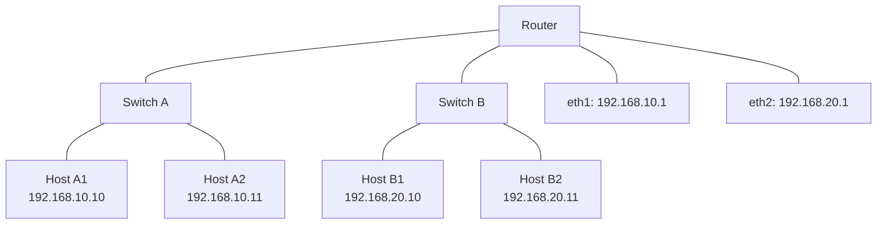

# Network Topology Diagram

```mermaid
flowchart TB
    R[Router]

    R --- SA[Switch A]
    R --- SB[Switch B]

    SA --- A1[Host A1<br/>192.168.10.10]
    SA --- A2[Host A2<br/>192.168.10.11]

    SB --- B1[Host B1<br/>192.168.20.10]
    SB --- B2[Host B2<br/>192.168.20.11]

    R --- RA[eth1: 192.168.10.1]
    R --- RB[eth2: 192.168.20.1]
```

## Network Details

**Subnet A:** 192.168.10.0/24

**Subnet B:** 192.168.20.0/24

The router connects both subnets and forwards traffic between them.
